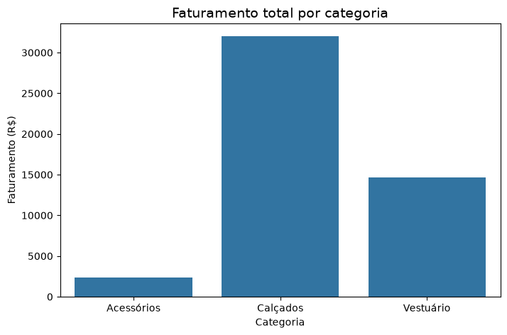

# Análise de Vendas - Portfólio de Ciência de Dados

**Ferramentas:** Python, Pandas, Matplotlib, Seaborn, Jupyter Notebook

## O que este projeto faz?

Analisa dados de vendas de uma loja fictícia para descobrir:
- Qual produto mais faturou
- Qual categoria mais vende
- Visualizar resultados em gráfico

## Resultados principais

- **Produto que mais faturou:** Tênis (R$ 31.980)
- **Categoria que mais faturou:** Calçados (R$ 31.980)

## Gráfico gerado

## Como executar

1. Baixe o arquivo `analise_vendas.ipynb`
2. Abra no Jupyter Notebook
3. Execute célula por célula (Shift + Enter)

---

*Projeto - portfólio de Ciência de Dados*
